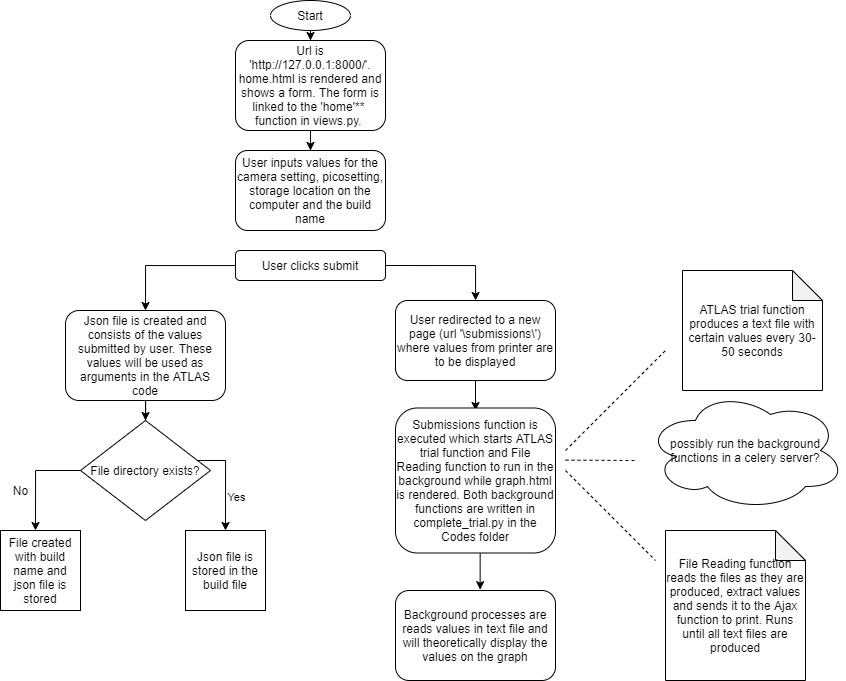

# GUI for ATLAS 

## Overview
The main role of this code is to have a guided user interface for the Atlas which is a 3-D printer. The main objectives are:
- To input sensor configurations.
- Store the data in a folder for each build done by ATLAS.
- Once the printer starts to produce the object, display live data from the sensors.
#### The flowchart below is a summary of the structure of the program

## Codes written
### 1) Main_page folder
- Views.py consists of the main structure of the program. It consists of functions which perform various operations along with rendering specific pages.
- Forms.py consists of the layout and data type of various settings for the ATLAS printer.
- Urls.py provides a URL for each page.
- The other files are not used/developed.
#### a) Views.py 
Views.py has 3 functions - 'home', 'submission' and 'fetch_sensor_values_ajax'
- 'home' function is for the first page where the user will input data into the form. It uses the POST method along with the forms in forms.py to use the input data and create a json file. Before the json file is created, the values are stored in a text file and from the text file the json file is created. The function also validates if  storage location is created or not. If it is not created then it will create a folder with the build name and store data there. If a folder already exists then it adds files to that folder. It renders the 'home.html' page.
- 'submission' function begins as soon as the user clicks submit on the first page. It renders the 'submissions.html' page while starting the functions - 'atlas_trial' and 'search' from the complete_trial.py code (will be explained in the Codes folder). These functions are run in the background.
- 'fetch_sensor_values_ajax' function will be used to display live data from the sensors. It is currently under development.

#### b) Forms.py
Forms.py consists of the layout and data structure required for various settings. The tuples in the code are the options which will be displayed to the user. The forms use these tuples to allow the user to make a choice

#### c) Urls.py
Urls.py show which function will run when a particular url is typed. While using the local server 'http://127.0.0.1' has will run the 'home' function from views.py while 'http://127.0.0.1/submission' will run the 'submissions' function from views.py

### 2) Codes folder
From the Codes folder, *'complete_trial.py' is the only one which is used*. The other codes were written previously before github was set up and are different versions of 'complete_trial.py'. The functions in the code and their explanation are as follows:
#### a) Atlas_trial
This creates a text file with 15 values every 5 seconds. It imitates the actual ATLAS code in the sense that a file with data is produced at varying intervals. *path variable location is hard coded* ie. add local directory to Project 2021.
#### b) Read_file
This reads a text file, extracts the values and returns the sum of all the values. This was written as an example to show how files will be read from the actual printer and may not work in real time.
#### c) Search
This function creates a new text file with extracted values from the data files the printer produces. It will constantly search for new files and if a new file is not created within a specific time, it will prove that the build has finished and can stop the code. It calls the 'search' function to read values and output the sum. Please note this does not work with the actual ATLAS code and it used as an example.
#### d) RunInParallel
This function calls both the 'atlas_trial' and the 'search' function and simultaneously run them in the background while the page is rendered.

### 3) Templates folder
The templates folder consists of html pages which are rendered by the functions.
#### a) Home.html
This page is used for the home page. It displays the forms as a list and also consists of submit button, which clicked redirects to the submissions page
#### b) Graph.html
This page *does not* display live data. It is only used to check if the background codes can run and a live graph can be displayed. It generates a random number every second which is then displayed live on the screen without the need to refresh. 
#### c) Atlas_graph.html
This page is currently under development to display live data from the sensors. Uses the Ajax method to collect and display live data.

## Conclusion
This was a UROP project undertaken by me - Aditya Titus. It was to learn and expand my skills in python and potentially developing further skills in html, django and databases. In the time frame given I was not able to fully finish it but I hope to get this done and running someday :)

